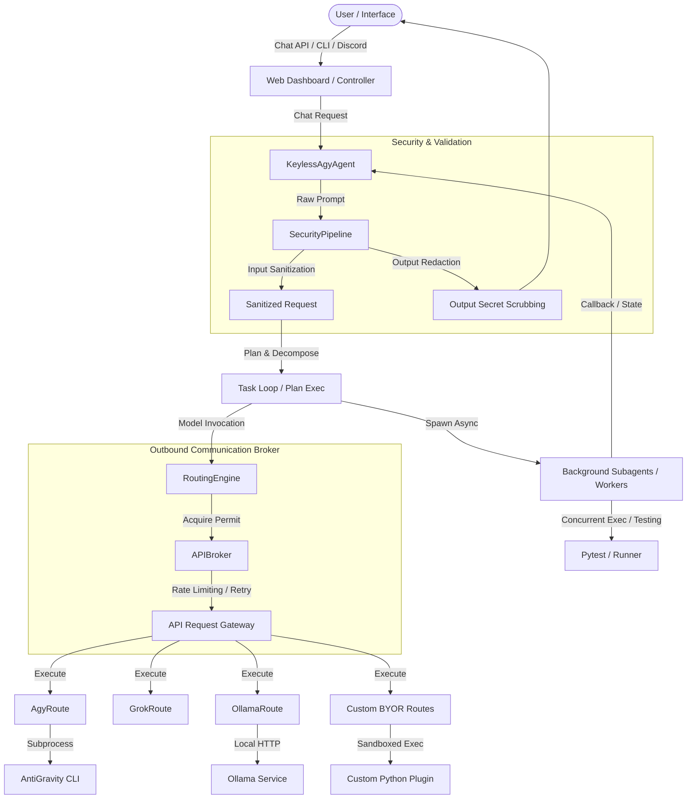

<!-- markdownlint-disable MD013 MD033 -->
# AGent-Ada: Task & Agent Orchestration Harness

[](https://www.python.org/)
[](LICENSE)
[](https://github.com/Enuclea/AGent-Ada)
[](https://github.com/google-antigravity/antigravity)

**AGent-Ada** is a production-grade, extensible AI orchestration engine built on top of Google AntiGravity. It delivers intelligent model routing with cost-aware failover, multi-agent delegation, background task orchestration, and deep security controls—all while remaining completely **keyless** using your existing `agy` CLI configurations.

Designed for power users, DevOps workflows, and Managed Service Provider (MSP) automation.

## 📢 Status & Maturity

Actively used in production at Enuclea LLC since June 2026.

---

## 🚀 Quick Start

Get AGent-Ada running locally in under two minutes:

1. **Clone & Set Up Virtual Environment**:

   ```bash
   git clone https://github.com/enuclea/agent-ada.git && cd agent-ada
   python3 -m venv .venv
   source .venv/bin/activate
   pip install -e .
   ```

2. **Configure Environment**:
   Copy `.env.example` to `.env` in the root workspace directory (see [Setup](#setup) for details):

   ```env
   GEMINI_API_KEY="your-gemini-developer-key"
   ROUTE_AGY_STATUS="primary"
   ```

3. **Run a Prompt**:

   ```bash
   .venv/bin/python -m agent.keyless "Write a checklist for SRE deployment"
   ```

---

## 🛠️ Core Capabilities

### 1. Extensible Keyless Agent Loop

The core harness is built around an asynchronous, non-blocking agent loop ([agent_loop.py](src/agent/core/agent_loop.py)) that manages:

* **Sequential Task Execution**: Complex instructions are decomposed into structured multi-step plans.
* **Background Subagent Spawning**: Spawns concurrent subagents to execute long-running tasks in the background without blocking the main session thread.
* **Unified State Persistence**: State is saved continuously via SQLite, supporting execution resumption and full telemetry logging.

### 2. Execution Routing & Model Failover Engine

AGent-Ada features a modular execution routing engine that decouples model invocation from underlying transports. It supports core AntiGravity CLI (`agy`), Grok fallback executions, local Ollama integrations, and custom execution pathways.

* **Core CLI (`agy`)**: The default execution path that delegates calls to the AntiGravity CLI (`agy`), utilizing Gemini developer APIs, Claude, or other pre-configured providers.
* **Grok Fallback (`grok`)**: Functions as a secondary execution route matching `agy` capabilities. It is configured to run when standard `agy` models fail or are bypassed.
* **Ollama (`ollama`)**: Integrates local Ollama LLMs (e.g., `ollama/gemma4:12b`, `qwen3.5:9b`). It automatically loads target hosts from `config/ollama_hosts.json`.

### 3. Centralized API Broker (`APIBroker`)

All outgoing communications can be funneled through a thread-safe, centralized API Broker:

* **Automatic Rate Limiting**: Enforces API bucket limits to prevent credentials throttling.
* **Transient Retry & Exponential Backoff**: Automatically catches network failures, timeouts, and HTTP 429 rate limit statuses, applying exponential sleep backoffs to ensure robust request execution.
* **GET Cache Manager**: Caches standard GET queries with a customizable TTL to prevent redundant calls and minimize API resource consumption.
* **API Execution Auditing**: Logs details of every outgoing API call to a local SQLite table `api_call_logs`.

### 4. Input & Output Security Pipeline

To protect your agents and system, all messages pass through an inline security sanitization pipeline ([pipeline.py](src/agent/security/pipeline.py)):

* **Input Sanitization**: Blocks prompt injection attempts, malicious command escapes, and unsafe path traversals.
* **Output Redaction**: Automatically scrubs and redacts API keys, passwords, and sensitive environment secrets before responses are written or sent.
* **Custom Route Loader Security**: Custom route modules are statically scanned to block world-writable permissions or unsafe system calls (`eval(`, `exec(`, `os.system(`, etc.).

### 5. Ollama-Compatible API — Sandbox Evaluation Honeypot

AGent-Ada exposes a full [Ollama-compatible REST API](src/agent/api/ollama_clone.py) (`/api/chat`, `/api/generate`, `/api/tags`, etc.) designed as a **controlled observation endpoint** for sandbox code evaluation.

When evaluating untrusted code, the code may attempt to interact with an LLM.  Rather than blocking these requests (which would alert the code to the sandbox) or returning fabricated responses (which would break execution flow), this interface provides **real LLM completions** through the keyless `agy` harness while maintaining strict isolation:

* **Genuine Model Responses**: Prompts are forwarded to Gemini via the `agy` CLI, producing authentic completions that allow normal code execution to continue uninterrupted.
* **Zero Tool Access**: The `agy` binary is invoked with `--sandbox` (terminal restrictions) and **without** `--dangerously-skip-permissions`.  Since `stdin` is `/dev/null`, tool permission prompts can never be approved — the harness is text-only regardless of what the prompt requests.
* **Silent Security Analysis**: Every request/response pair is asynchronously scanned for prompt injection attempts, suspicious tool invocation patterns (`subprocess`, `eval`, `exec`, sandbox escape language), and unsafe Python code blocks.  Detections are logged to telemetry without alerting the caller.
* **Three-Layer Security Model**:
  1. **Harness-level denial** — `--sandbox` flag + no permission auto-approve
  2. **Process isolation** — `stdin=DEVNULL` prevents interactive tool approval
  3. **Payload analysis** — AST safety checks, keyword scanning, and telemetry logging

This makes the interface a transparent observation layer: malicious code gets real LLM responses but zero actual tool access, and every interaction is captured for security evaluation before code is promoted from the sandbox to production.

---

## 📐 System Architecture Diagram



---

## 🔄 Failover & Routing Strategy

AGent-Ada implements a robust, multi-tier execution strategy to ensure continuous availability even during frontier API degradation:

1. **Intelligent Routing Priority**: When a prompt is submitted, the [RoutingEngine](src/agent/core/routing.py) filters and orders active routes according to environment flags (e.g., `ROUTE_AGY_STATUS="primary"`, `ROUTE_GROK_STATUS="secondary"`).
2. **Outage Detection & Circuit Breaker**: If a primary route (e.g., `agy` or a custom client route) raises a connection error or times out, the engine catches the exception and immediately fails over to the next configured fallback in the pipeline.
3. **Background Health Check Tasks**: Upon a primary route failure, the system automatically spawns a background health checker (`check_primary_route_health`). This task sends periodic, non-blocking check prompts (every 60 seconds) to determine when the primary API recovers. Once recovery is verified, it resets the routing state.
4. **Interactive vs. Scheduled Execution**: Scheduled tasks can be restricted to low-cost or offline routes (such as Ollama), while user-facing interactive queries are routed with higher priority to low-latency cloud routes.

> [!NOTE]
> For implementation details and verification of the model failover sequence under simulated network outages, refer to the detailed [Failover Plan Doc](docs/failover_plan.md) and [test_failover.py](tests/test_failover.py).

---

## 💸 Cost Management

To prevent runaway API expenses and ensure cost-efficient orchestrations, AGent-Ada uses three primary guardrails:

* **Preference Class Optimization**: Route definitions specify default priority ranks. The routing loop evaluates routes starting from the most cost-effective tier (such as local Ollama instances or keyless `agy` CLI executions) before attempting premium commercial endpoints.
* **Expensive-Model Gating**: Users can configure specific model identifiers (e.g., `claude-3-opus`, `gemini-1.5-pro`) to require explicit authorization prompts or restrict their execution strictly to high-priority interactive calls.
* **Token Usage Tracker**: Token usage is audited in the `token_telemetry` table. It captures input/output tokens, target models, and estimated costs per session to ensure compliance with organization billing thresholds.

---

## 🔌 Decoupled Plugin System

To keep the core harness clean and free from environmental pollution, all custom integrations, scraping scripts, and automation handlers can be placed into a root `/plugins/` directory.

### How the Core Loads Plugins

The core engine imports plugins dynamically at runtime using `importlib`. If the `/plugins/` folder is empty, the engine operates strictly as a generic model orchestration baseline.

### Example Decoupled Plugin

Below is a simple template for a decoupled plugin that registers a custom specialist subagent profile:

```python
# plugins/my_plugin/__init__.py
from agent.core.registry import tool_registry

def initialize_plugin():
    # Register custom subagent instructions
    tool_registry.register_subagent_profile(
        name="log_cleaner",
        system_instructions="You are a log cleaner. Scan text files and remove ANSI formatting characters."
    )
```

---

## 🔌 Bring Your Own Route (BYOR)

You can easily inject custom LLM wrappers, third-party API clients, or custom local gateways into the harness by dropping a Python module into the `src/agent/routes/custom/` directory.

### Example Custom Route: Local Ollama Custom Gateway

Here is an example showing how to implement a custom route targeting a specific Ollama model.

> [!IMPORTANT]
> Make sure `httpx` is included in your project dependencies. Alternatively, you can use the centralized HTTP client managed by the core API Broker.

```python
# src/agent/routes/custom/custom_ollama.py
import httpx
from typing import List, Optional
from agent.routes.base import BaseRoute, RouteStatus

class CustomOllamaRoute(BaseRoute):
    @property
    def name(self) -> str:
        return "custom_ollama"

    @property
    def default_status(self) -> RouteStatus:
        return RouteStatus.SECONDARY

    @property
    def default_priority(self) -> int:
        return 25

    @property
    def supported_models(self) -> List[str]:
        return ["ollama/llama3"]

    async def execute(
        self,
        prompt: str,
        model: str,
        system_instructions: Optional[str] = None,
        timeout: Optional[float] = None,
        conversation_id: Optional[str] = None,
        task_priority: Optional[int] = None,
    ) -> Optional[str]:
        url = "http://localhost:11434/api/generate"
        payload = {
            "model": "llama3",
            "prompt": prompt,
            "system": system_instructions or "",
            "stream": False
        }
        try:
            async with httpx.AsyncClient(timeout=timeout or 60.0) as client:
                resp = await client.post(url, json=payload)
                if resp.status_code == 200:
                    return resp.json().get("response")
        except Exception:
            return None
```

---

## 📊 Observability & Telemetry

AGent-Ada comes pre-equipped with an observability suite built for operators:

* **Detailed Telemetry Tables**: The engine continuously records execution state changes in `telemetry_logs` and token usage metrics in `token_telemetry`.
* **Outbound API Auditing**: Outbound requests funneled through the API Broker are logged to the `api_call_logs` table, tracking route endpoints, response status codes, latencies, and network retry statistics.
* **Quiet Observer & PubSub**: The [telemetry.py](src/agent/observability/telemetry.py) module supports publish-subscribe notification loops, feeding task completions and service alerts directly into Discord frontends or external logging endpoints.

---

## 💻 CLI Commands & Web Dashboard Features

### CLI Commands

* **Run Prompt Directly**:
  
  ```bash
  .venv/bin/python -m agent.keyless "Create a checklist for SRE deployment"
  ```

* **Execute Roundtable Manually**:
  
  ```bash
  .venv/bin/python scripts/roundtable.py --conversation-id my-convo-id
  ```

### Web Dashboard & Chat Controls

The web interface exposes an administrative endpoint and a chat loop. You can issue special control commands inside the chat prompt:

* `/reload`: Evicts all active cached sessions, reloads the `/plugins/` directory, and clears environment variables to apply fresh updates.
* `/stop`: Instantly cancels all active background subagents and halts running plans for the active session.

---

<a name="setup"></a>

## ⚙️ Full Setup & systemd Service Guide

### 1. Environment Configuration Example (`.env`)

Create a `.env` file in the root workspace directory:

```env
# API Keys & Credentials
DISCORD_BOT_TOKEN="your-bot-token"
GEMINI_API_KEY="your-gemini-developer-key"

# Route Customizations
ROUTE_AGY_STATUS="primary"
ROUTE_GROK_STATUS="secondary"
ROUTE_OLLAMA_STATUS="off"

# Loop controls
VERIFICATION_LOOP_MINUTES=10
```

### 2. Systemd Service Templates

Create the service file `/etc/systemd/system/ada.service`:

```ini
[Unit]
Description=Ada Task Engine Core Daemon
After=network.target

[Service]
Type=simple
User=agentuser
WorkingDirectory=/opt/agent-ada
ExecStart=/opt/agent-ada/.venv/bin/python -m agent.interfaces.web
Restart=always
RestartSec=10
EnvironmentFile=/opt/agent-ada/.env

[Install]
WantedBy=multi-user.target
```

For the Discord connector, create `/etc/systemd/system/discord-bot.service`:

```ini
[Unit]
Description=Ada Discord Front-End Bot
After=ada.service
Requires=ada.service

[Service]
Type=simple
User=agentuser
WorkingDirectory=/opt/agent-ada
ExecStart=/opt/agent-ada/.venv/bin/python -m agent.interfaces.discord_bot
Restart=always
RestartSec=10
EnvironmentFile=/opt/agent-ada/.env

[Install]
WantedBy=multi-user.target
```

* **Enable and Start Services**:
  
  ```bash
  sudo systemctl daemon-reload
  sudo systemctl enable --now ada.service discord-bot.service
  ```

---

## 🗄️ Database Architecture

AGent-Ada maintains application state in a local SQLite database file.

### Default Database

By default, the engine connects to `agent.db` (configurable via `AGENT_DB_PATH` in `.env`). In custom production deployments, this may be configured to point to a custom database file.

### Core Database Tables

* **`persistent_memory`**: Stores user memory/fact key-values.
* **`conversation_steps`**: Stores step-by-step logs for interactive chats.
* **`conversation_search`**: FTS5 virtual table for full-text search across conversations.
* **`active_tasks`**: Tracks status, start time, and completion metrics for long-running plans.
* **`task_logs`**: Stores raw task output logs.
* **`task_checkpoints`**: Serializes execution state to resume tasks on crash/restart.
* **`token_telemetry`**: Audits model token consumption and estimated costs.
* **`api_call_logs`**: Logs endpoint execution latency, status codes, and error tracebacks.
* **`scheduled_tasks`**: Holds metadata and run statistics for scheduled cron tasks.
* **`workers`**: Tracks remote host endpoints, capabilities, and heartbeat health.

---

## 🔧 Troubleshooting

### 1. Ollama Host Configuration Failures

* **Symptom**: Outgoing prompts fail to execute through the local `ollama`
  route.
* **Resolution**:
  1. Confirm that `config/ollama_hosts.json` contains valid target IP/port pairs
     (e.g. `["http://127.0.0.1:11434"]`).
  2. Verify the Ollama daemon is running (`systemctl status ollama`).
  3. Make sure the daemon binds to all interfaces if running on a remote system
     (`OLLAMA_HOST=0.0.0.0`).

### 2. Custom Route Security Blocks

* **Symptom**: Warnings in the routing log state: `[ROUTING] Security block:
  Refusing to load custom route...`.
* **Resolution**:
  1. The route file cannot be world-writable. Execute `chmod 644
     src/agent/routes/custom/<your_route>.py` to correct file permissions.
  2. Statically audit the file and remove disallowed system call patterns.
     Disallowed patterns include: `eval(`, `exec(`, `os.system(`,
     `subprocess.Popen(`, and `subprocess.run(`.

### 3. Grok Route Execution Failure

* **Symptom**: Grok fallback fails with subprocess execution errors.
* **Resolution**: Ensure the `grok` CLI binary is installed, globally
  executable, and accessible in your `$PATH`.

---

## 🗺️ Roadmap & Upcoming Features

- [ ] **Unified Plugin Marketplace**: Graphical registry to install, update,
  and manage community-made extensions.
- [ ] **Sandboxed WebAssembly (Wasm) Runtime**: Execute third-party custom
  routes in a highly restricted sandbox instead of raw Python `importlib`.
- [ ] **Advanced Agent Evaluation Suite**: Automation pipelines to test model
  output variations against regression targets.
- [ ] **Expanded Built-in Providers**: Standard routes for DeepSeek-R1,
  Anthropic Direct APIs, and local Llama.cpp servers.
