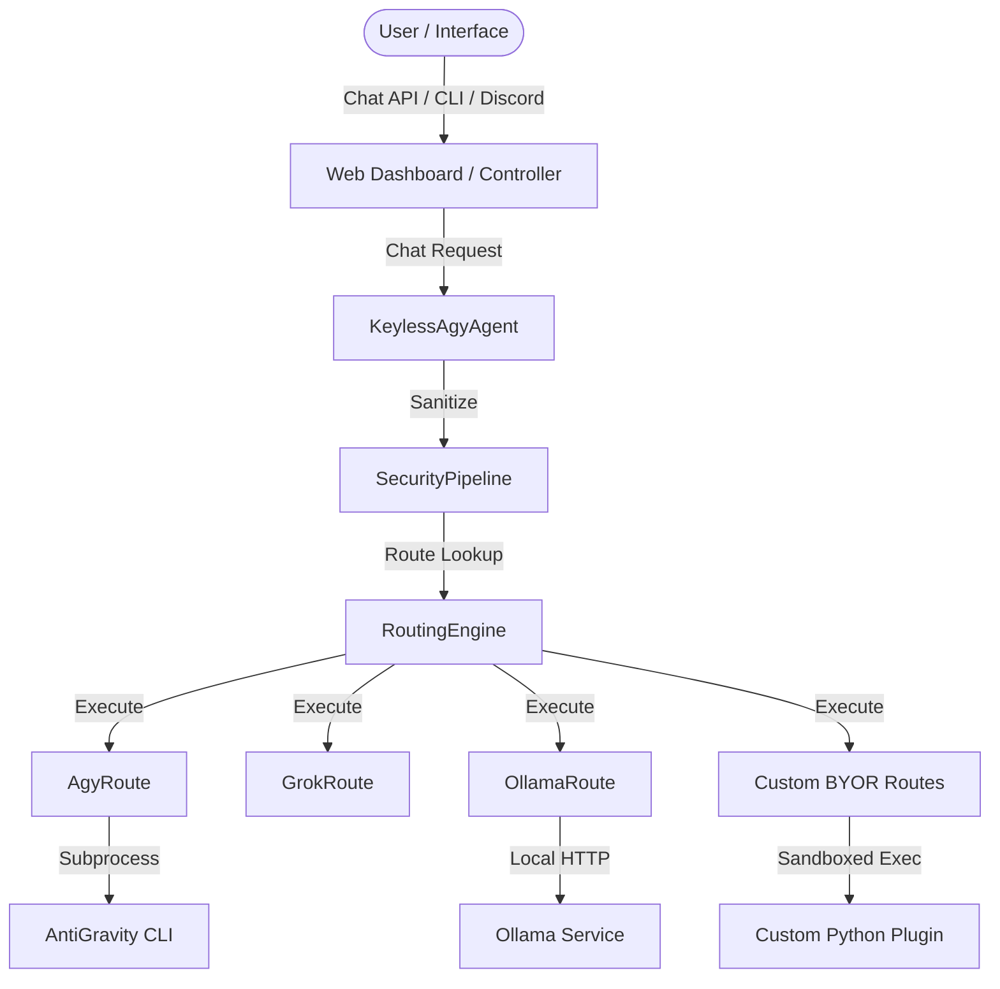

# AGent-Ada: Task & Agent Orchestration Harness

AGent-Ada is an extensible, AI-driven task orchestration engine and automation harness. It provides model routing, multi-agent delegation, prompt sanitization, custom execution pathways, and background worker orchestration.

---

## 🛠️ Core Capabilities

### 1. Extensible Keyless Agent Loop
The core harness is built around an asynchronous, non-blocking agent loop that manages:
*   **Sequential Task Execution**: Complex instructions are decomposed into structured multi-step plans.
*   **Background Subagent Spawning**: Spawns concurrent subagents to execute long-running tasks in the background without blocking the main session thread.
*   **Unified State Persistence**: State is saved continuously via SQLite, supporting execution resumption and full telemetry logging.

### 2. Execution Routing & Model Failover Engine
AGent-Ada features a modular execution routing engine that decouples model invocation from underlying transports. It supports core AntiGravity CLI (`agy`), Grok fallback executions, local Ollama integrations, and custom execution pathways.

*   **Core CLI (`agy`)**: The default execution path that delegates calls to the AntiGravity CLI (`agy`), utilizing Gemini developer APIs, Claude, or other pre-configured providers.
*   **Grok Fallback (`grok`)**: Functions as a secondary execution route matching `agy` capabilities. It is configured to run when standard `agy` models fail or are bypassed.
*   **Ollama (`ollama`)**: Integrates local Ollama LLMs (e.g., `ollama/gemma4:12b`, `qwen3.5:9b`). It automatically loads target hosts from `config/ollama_hosts.json`.

### 3. Centralized API Broker (`APIBroker`)
All outgoing communications can be funneled through a thread-safe, centralized API Broker:
*   **Automatic Rate Limiting**: Enforces API bucket limits to prevent credentials throttling.
*   **Transient Retry & Exponential Backoff**: Automatically catches network failures, timeouts, and HTTP 429 rate limit statuses, applying exponential sleep backoffs to ensure robust request execution.
*   **GET Cache Manager**: Caches standard GET queries with a customizable TTL to prevent redundant calls and minimize API resource consumption.
*   **API Execution Auditing**: Logs details of every outgoing API call to a local SQLite table `api_call_logs`.

### 4. Input & Output Security Pipeline
To protect your agents and system, all messages pass through an inline security sanitization pipeline:
*   **Input Sanitization**: Blocks prompt injection attempts, malicious command escapes, and unsafe path traversals.
*   **Output Redaction**: Automatically scrubs and redacts API keys, passwords, and sensitive environment secrets before responses are written or sent.
*   **Custom Route Loader Security**: Custom route modules are statically scanned to block world-writable permissions or unsafe system calls (`eval(`, `exec(`, `os.system(`, etc.).

---

## 📐 System Architecture Diagram



---

## 🔌 Decoupled Plugin System

To keep the core harness clean and free from environmental pollution, all custom integrations, scraping scripts, and automation handlers can be placed into a root `/plugins/` directory.

### How the Core Loads Plugins
The core engine imports plugins dynamically at runtime using `importlib`. If the `/plugins/` folder is empty, the engine operates strictly as a generic model orchestration baseline.

### Example Decoupled Plugin
Below is a simple template for a decoupled plugin that registers a custom specialist subagent profile:

```python
# plugins/my_plugin/__init__.py
from agent.core.registry import tool_registry

def initialize_plugin():
    # Register custom subagent instructions
    tool_registry.register_subagent_profile(
        name="log_cleaner",
        system_instructions="You are a log cleaner. Scan text files and remove ANSI formatting characters."
    )
```

---

## 🔌 Bring Your Own Route (BYOR)

You can easily inject custom LLM wrappers, third-party API clients, or custom local gateways into the harness by dropping a Python module into the `src/agent/routes/custom/` directory.

### Example Custom Route: Local Ollama Custom Gateway
Here is an example showing how to implement a custom route targeting a specific Ollama model:

```python
import httpx
from typing import List, Optional
from agent.routes.base import BaseRoute, RouteStatus

class CustomOllamaRoute(BaseRoute):
    @property
    def name(self) -> str:
        return "custom_ollama"

    @property
    def default_status(self) -> RouteStatus:
        return RouteStatus.SECONDARY

    @property
    def default_priority(self) -> int:
        return 25

    @property
    def supported_models(self) -> List[str]:
        return ["ollama/llama3"]

    async def execute(
        self,
        prompt: str,
        model: str,
        system_instructions: Optional[str] = None,
        timeout: Optional[float] = None,
        conversation_id: Optional[str] = None,
        task_priority: Optional[int] = None,
    ) -> Optional[str]:
        url = "http://localhost:11434/api/generate"
        payload = {
            "model": "llama3",
            "prompt": prompt,
            "system": system_instructions or "",
            "stream": False
        }
        try:
            async with httpx.AsyncClient(timeout=timeout or 60.0) as client:
                resp = await client.post(url, json=payload)
                if resp.status_code == 200:
                    return resp.json().get("response")
        except Exception:
            return None
```

---

## 💻 CLI Commands & Web Dashboard Features

### CLI Commands
*   **Run Prompt Directly**:
    ```bash
    .venv/bin/python -m agent.keyless "Create a checklist for SRE deployment"
    ```
*   **Execute Roundtable Manually**:
    ```bash
    .venv/bin/python scripts/roundtable.py --conversation-id my-convo-id
    ```

### Web Dashboard & Chat Controls
The web interface exposes an administrative endpoint and a chat loop. You can issue special control commands inside the chat prompt:
*   `/reload`: Evicts all active cached sessions, reloads the `/plugins/` directory, and clears environment variables to apply fresh updates.
*   `/stop`: Instantly cancels all active background subagents and halts running plans for the active session.

---

## ⚙️ Full Setup & systemd Service Guide

### 1. Environment Configuration Example (`.env`)
Create a `.env` file in the root workspace directory:

```env
# API Keys & Credentials
DISCORD_BOT_TOKEN="your-bot-token"
GEMINI_API_KEY="your-gemini-developer-key"

# Route Customizations
ROUTE_AGY_STATUS="primary"
ROUTE_GROK_STATUS="secondary"
ROUTE_OLLAMA_STATUS="off"

# Loop controls
VERIFICATION_LOOP_MINUTES=10
```

### 2. Systemd Service Templates

Create the service file `/etc/systemd/system/ada.service`:

```ini
[Unit]
Description=Ada Task Engine Core Daemon
After=network.target

[Service]
Type=simple
User=agentuser
WorkingDirectory=/opt/agent-ada
ExecStart=/opt/agent-ada/.venv/bin/python -m agent.interfaces.web
Restart=always
RestartSec=10
EnvironmentFile=/opt/agent-ada/.env

[Install]
WantedBy=multi-user.target
```

For the Discord connector, create `/etc/systemd/system/discord-bot.service`:

```ini
[Unit]
Description=Ada Discord Front-End Bot
After=ada.service
Requires=ada.service

[Service]
Type=simple
User=agentuser
WorkingDirectory=/opt/agent-ada
ExecStart=/opt/agent-ada/.venv/bin/python -m agent.interfaces.discord_bot
Restart=always
RestartSec=10
EnvironmentFile=/opt/agent-ada/.env

[Install]
WantedBy=multi-user.target
```

*   **Enable and Start Services**:
    ```bash
    sudo systemctl daemon-reload
    sudo systemctl enable --now ada.service discord-bot.service
    ```

---

## 🗄️ Database Architecture
AGent-Ada maintains local application state in a SQLite database (`agent.db` or `enuclea.db`):
*   `morgen_tasks`: Tracks calendar integration event statuses.
*   `tracked_atera_items`: Maps tasks to external IT tickets/alert resources.
*   `availability_alert_checks`: Manages offline alert check cycles.
*   `daily_automation_rollups`: Consolidates multi-step daily tasks.
*   `api_call_logs`: Auditing table logging execution times, status, and failures of broker requests.
